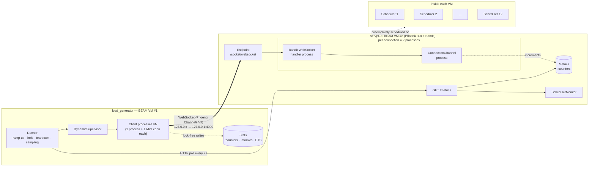

# Can Elixir Handle 100,000 Concurrent Connections?

An independent, reproducible experiment: how many persistent WebSocket
connections can a single Phoenix/BEAM node hold, what does each one cost, and
which limit gives out first: the BEAM, the kernel, or the machine?

The project moves up in explicit steps (1k → 5k → 10k → 25k → 50k → 100k).
Every number in this repository comes from a run that actually happened, and
each run's result file is in [`results/`](results/). Steps that haven't been
run have no numbers.

**Status (Part 1):** 1,000, 5,000 and 10,000 connections verified on a
laptop (WSL2, 12 logical CPUs, 7.6 GiB RAM). 25k and above have not been run
yet. See [RESULTS.md](RESULTS.md).

## Architecture



* **Server** ([`server/`](server/)): a Phoenix app with no database, HTML,
  assets or auth. A client connects to `LoadSocket`, gets a server-assigned
  `client_id` when it joins `connections:lobby`, and can send `ping` events
  that are echoed back. Counters live in a single `:counters` array, so
  instrumentation never funnels through one process.
* **Load generator** ([`load_generator/`](load_generator/)): a separate Mix
  project. Each simulated client is **one BEAM process** that owns a
  [Mint](https://hex.pm/packages/mint) WebSocket connection, not an OS
  process or thread. Latencies go into a lock-free log-bucketed histogram.
* **Scripts** ([`scripts/`](scripts/)): start the server, run one benchmark
  step, print system limits, watch metrics live.

Key decisions and the reasons for them are explained in
[BENCHMARKING.md](BENCHMARKING.md#design-decisions).

## Quick start

Requirements: Elixir ≥ 1.15, Erlang/OTP ≥ 25, Linux (or WSL2), `curl`, `jq`.
No database and no Node.js.

```bash
# 1. Start the server (prod mode, bound to 127.0.0.1:4000)
./scripts/start_server.sh

# 2. In another terminal, run the first benchmark step
./scripts/run_benchmark.sh 1000
```

This opens 1,000 WebSockets, holds them for 60s while every client pings
every 30s, closes them all, and writes `results/1000.json` plus a row in
`results/summary.csv`.

### Running the load generator directly

```bash
cd load_generator
mix deps.get
mix load_test --connections 1000 --ramp-up 5 --duration 60 --message-interval 30000 \
  --output ../results/manual-1000.json
```

| Option | Default | Meaning |
|---|---|---|
| `--connections N` | *(required)* | concurrent clients |
| `--ramp-up S` | 10 | spread connection starts over S seconds |
| `--duration S` | 60 | hold everything open for S seconds after ramp-up |
| `--message-interval MS` | 30000 | per-client ping interval (0 = no pings) |
| `--message-rate N` | – | total pings/s across all clients (overrides interval) |
| `--connection-duration S` | – | each client closes itself after S seconds |
| `--source-ips A,B,…` | – | loopback source addresses, round-robin |
| `--min-free-mb MB` | 512 | safety stop if host `MemAvailable` drops below |
| `--output PATH` / `--csv PATH` | – | JSON result / append CSV summary row |
| `--allow-remote` | off | permit a non-loopback target you control |

Run `mix help load_test` for the full list.

### Watching a run

```bash
./scripts/watch_metrics.sh     # one line every 2s from GET /metrics
./scripts/system_limits.sh     # read-only report of fd, port, TCP and BEAM limits
curl -s localhost:4000/metrics | jq
```

## Tests

```bash
cd server && mix test                        # 23 tests
cd load_generator && mix test                # 38 unit tests
cd load_generator && mix test --include integration   # +2, needs a running server
```

## Safety

* The server binds to `127.0.0.1` by default.
* The load generator refuses non-loopback targets and non-loopback source IPs
  unless `--allow-remote` is passed.
* `--connections` has no default, and `run_benchmark.sh` asks for confirmation
  at 25,000 or more. There is no "run all steps" command.
* A memory guard stops ramp-up and tears everything down if the machine's
  `MemAvailable` falls below `--min-free-mb`.
* Nothing in this repository changes system settings. Suggested changes, with
  how to revert them, are in [BENCHMARKING.md](BENCHMARKING.md#system-limits).

## Repository layout

```
.
├── server/                 Phoenix app under test
│   ├── lib/elixir_100k_connections/        Metrics, RuntimeStats, SchedulerMonitor
│   └── lib/elixir_100k_connections_web/    LoadSocket, ConnectionChannel, MetricsController
├── load_generator/         Mix project: `mix load_test`
│   └── lib/load_generator/                 Config, Runner, Client, Stats, Histogram, Report, …
├── scripts/                start_server.sh, run_benchmark.sh, system_limits.sh, watch_metrics.sh
├── results/                <N>.json (latest per step), summary.csv, runs/ (every run)
├── docs/medium-part-1.md   Part 1 write-up
├── BENCHMARKING.md         methodology, metrics, limits, how to reproduce
├── DEVELOPMENT.md          environment the results were produced on
└── RESULTS.md              results so far
```

## License

MIT, see [LICENSE](LICENSE).
