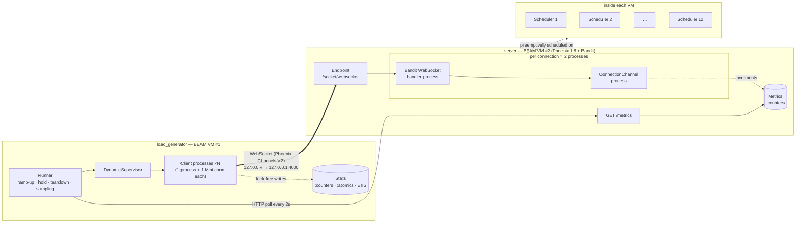

# Can Elixir Handle 100,000 Concurrent Connections? I Tried It.

*Part 1: building the lab, and the first 10,000*

---

Every few months someone in a thread about real-time apps says "just use
Elixir, the BEAM can hold millions of connections." Usually someone links
the Phoenix team's 2015 write-up about two million WebSocket connections on
a single server, or the stories about WhatsApp running Erlang with millions
of connections per box.

I believe those numbers. But they came from big servers, tuned by the people
who wrote the software. The machine I actually own is a laptop running Linux
under WSL2, with 12 logical CPUs, 7.6 GiB of RAM, and an editor that's
already using a good chunk of it.

So I wanted to test this myself, from an empty directory, measuring
everything and taking nothing on faith. This series is the result. Part 1
covers the lab and the first three steps: 1,000, 5,000 and 10,000
connections.

**Spoiler, so nobody feels misled: I haven't reached 100,000 yet.** I got
to 10,000 with zero failures, found two things that surprised me, and now
know exactly which wall I'll hit next. It isn't the one I expected.

## The question

"Can Elixir handle 100k connections?" is too vague to answer, so I pinned it
down:

> Can **one Phoenix node** on **this laptop** keep **100,000 WebSocket
> clients** connected, joined to a channel, and answering pings, and what
> does each connection cost in memory, processes and CPU?

I also decided to climb in steps (1k, 5k, 10k, 25k, 50k, 100k) and only
take the next step once the previous one was understood. Jumping straight to
100k tells you that something broke, but rarely what.

## What "100,000 concurrent connections" actually means

This is the part I see confused most often, so it's worth being precise.

**Concurrent connections are not requests per second.** A requests/sec
benchmark measures throughput: how fast you can turn work around. A
concurrent-connections benchmark measures *state*: how many long-lived
sessions you can hold at once, most of them doing nothing.

An idle WebSocket costs almost no CPU. What it costs is:

- **memory**: process heaps, socket buffers in the VM and in the kernel
- **a file descriptor** on each side
- **a port** inside the BEAM (every TCP socket is one)
- **an ephemeral port** on the client
- **processes**: in Phoenix, at least one per connection, plus one per
  channel joined

So "handling" a connection here means: TCP connected, WebSocket upgraded,
channel joined, and still answering a ping every 30 seconds (the Phoenix
JavaScript client's default heartbeat interval). A connection that's open
but not answering doesn't count.

## Why the BEAM is interesting for this

Most runtimes make you choose between "one thread per connection" (simple,
but threads are expensive) and "an event loop" (cheap, but you write
callbacks and one slow handler blocks everyone).

The BEAM gives you a third option: one *process* per connection, where a
process is a VM-level construct that starts at around 2–3 KB of memory and
is preemptively scheduled across one scheduler thread per CPU thread. You write
straightforward sequential code per connection, and the VM handles fairness.

That's the theory. The experiment is to find out what it costs in practice,
with Phoenix on top.

## The architecture

I kept it deliberately small. No database, no auth, no HTML, no JavaScript.
Two Mix projects and some shell scripts:



**The server** is a fresh Phoenix 1.8 app with almost everything removed. A
client connects to a socket, joins `connections:lobby`, and gets back a
server-assigned `client_id`. It can then push `ping` and get its payload
echoed back. That's the whole protocol:

```elixir
def join("connections:lobby", _payload, socket) do
  Metrics.connection_joined()
  {:ok, %{client_id: socket.assigns.client_id}, socket}
end

def handle_in("ping", payload, socket) do
  Metrics.message_received()
  Metrics.message_sent()
  {:reply, {:ok, %{echo: payload, client_id: socket.assigns.client_id,
                   server_time_us: System.system_time(:microsecond)}}, socket}
end

def terminate(_reason, _socket) do
  Metrics.connection_closed()
  :ok
end
```

I made a few choices on purpose:

- **Channel logging is off** (`log_join: false, log_handle_in: false`). At
  100k joins, Logger would become the thing being benchmarked.
- **The socket has no `id`.** Returning `nil` from `id/1` means Phoenix
  doesn't create a PubSub subscription per connection.
- **The server binds to 127.0.0.1** and runs in prod mode. Dev mode's code
  reloader and debug logs would skew the results.

**Instrumentation** was the first place I had to think about concurrency.
The obvious way to count things in Elixir is a GenServer holding a map. With
10,000 processes calling it, that GenServer becomes a queue that every
connection waits in. So the counters are a single `:counters` array, which
uses atomic increments, with no process and no messages:

```elixir
def increment(name, by \\ 1),
  do: :counters.add(ref(), Map.fetch!(@indexes, name), by)
```

A `GET /metrics` endpoint returns those counters plus BEAM statistics:
process count, port count, memory breakdown, run queue, and scheduler
utilization (sampled once a second by a tiny GenServer). It also reports a
few Linux facts from `/proc`: RSS, open file descriptors, and kernel TCP
socket stats.

One detail I nearly got wrong: my first version of the scheduler sampler
wrote its result to `:persistent_term` every second. Reading a persistent
term is free, but *updating* one makes the VM scan every process on the
node. That's harmless at 500 processes and exactly what you don't want at
200,000. I moved it into GenServer state before it ever ran.

## How the load generator works

The load generator is a separate Mix project (`mix load_test --connections
1000`). The rule I set myself: **no OS process or thread per client.** If
the point is to explore the BEAM's concurrency model, the client side
should use it too.

Each simulated client is one GenServer that owns one
[Mint](https://hex.pm/packages/mint) connection. Mint has no processes of
its own: the connection is just a data structure, and socket data arrives
as ordinary messages to whoever owns it. So one client really is one
lightweight process plus one TCP socket.

A client works through a small state machine:

```
:connecting → :upgrading → :joining → :joined → :closing
```

It connects in `handle_continue/2`, so starting it never blocks the runner,
and it records every outcome (connected, failed with reason, disconnected,
closed cleanly) in shared counters.

A few details turned out to matter:

- **Ramp-up is paced.** The runner starts clients on a 10 ms tick so they
  arrive at a steady rate (1,000/s by default), not all in one burst.
- **Pings are jittered.** Each client's first ping is randomised across one
  interval. Without that, every client that joined in the same 10 ms tick
  would ping in the same 10 ms tick forever, and a smooth 333 msgs/s would
  become a spike every 30 seconds.
- **Latency is recorded without a bottleneck.** Thousands of clients send
  RTT samples, so instead of a collector process I used a histogram stored
  in a `:counters` array: 400 buckets, each 5% wider than the last. Every
  client increments its bucket directly. The `max` value needs
  compare-and-swap, which `:atomics` provides. (My first version used a
  read-then-write loop, which loses updates under contention. A test that
  hammers it from 100 processes now guards against that.)
- **The runner samples both sides every 2 seconds**: its own counters, its
  own VM, the server's `/metrics` (fetched from a separate process so a slow
  response can't stall the ramp), and the host's `MemAvailable`.
- **There's a safety guard.** If `MemAvailable` drops below 512 MB, the
  runner stops ramping, tears everything down, and records the run as
  `"aborted"`. On a laptop I'm also using for everything else, that guard
  matters.

When the hold ends, every client sends a close frame and the runner checks
that the server's `active_connections` gauge returns to zero. Each run
produces a JSON file with the configuration, the environment, a summary and
the full sample timeline, plus a row in a CSV file for graphing later.

Safety was a design goal, not an afterthought. The load generator refuses
non-loopback targets unless you pass `--allow-remote`. `--connections` has
no default. The benchmark script asks for confirmation at 25,000 and above,
and there's deliberately no "run all steps" command.

## The test environment

| | |
|---|---|
| Machine | laptop, Intel Core i5-1245U (2 P-cores + 8 E-cores, 12 threads) |
| OS | Ubuntu 24.04 on WSL2, kernel 6.6 |
| RAM | 7.6 GiB visible to WSL; ~1.6–2.3 GiB actually free |
| Erlang/OTP | 26.1.2, 12 schedulers |
| Elixir / Phoenix / Bandit | 1.17.0 / 1.8.15 / 1.12.5 |
| Topology | client and server on the same machine, over loopback |

That last row is the biggest caveat. Client and server compete for the same
CPU and the same RAM, and loopback has no real network. RTTs here are a
floor, not something a user would ever see.

## System limits: what's in the way before Elixir even matters

Before running anything big, I wrote a read-only script to print every limit
I thought might matter, then checked each one against 100k.

- **File descriptors.** `ulimit -n` was already 1,048,576 on this WSL setup.
  Not a problem.
- **The BEAM process limit.** The default is **262,144**. The first real
  run showed the server uses exactly **2.0 processes per connection** (the
  Bandit WebSocket handler, plus the channel). 100k connections means 200k
  processes, close enough to the default limit to be uncomfortable. Both
  scripts start the VMs with `+P 2000000`, a per-VM flag rather than a
  system change.
- **Ephemeral ports.** The local port range is `32768–60999`, which gives
  **28,232 ports**. Every client socket going to `127.0.0.1:4000` needs its
  own source port, so one source IP tops out around 28k connections. On
  Linux the whole `127.0.0.0/8` block is loopback, so the load generator can
  bind clients to `127.0.0.2`, `127.0.0.3` and so on (`--source-ips`), with no
  sysctl change. I checked this with 127.0.0.2 and 127.0.0.3. I also noticed
  that after a WebSocket close, the `TIME_WAIT` entries sit on the *server*
  side (port 4000), so back-to-back runs don't eat client ports.
- **Accept backlog.** `tcp_max_syn_backlog` is 512 and `somaxconn` is 4,096.
  At 1,000 new connections per second, `ListenOverflows` and `ListenDrops`
  both stayed at zero.
- **Memory.** This is the one that will actually decide the outcome, but I
  didn't know that yet.

I didn't change any system setting. Where a change might be needed later,
the docs list the current value, the command, and how to revert it.

## Initial results

Here are the three steps I ran. All of them used a 60-second hold, one ping
per client every 30 seconds, and the default server configuration.

| | 1,000 | 5,000 | 10,000 |
|---|---:|---:|---:|
| Connected | 1,000 / 1,000 | 5,000 / 5,000 | 10,000 / 10,000 |
| Failed / disconnected | 0 / 0 | 0 / 0 | 0 / 0 |
| Ping RTT p50 / p99 | 1.30 / 2.84 ms | 1.13 / 2.58 ms | 1.24 / 5.11 ms |
| Connect latency p99 | 13.5 ms | 37.7 ms | 41.6 ms |
| Server BEAM memory per connection | 36.8 KB | 37.6 KB | 37.9 KB |
| Server processes per connection | 2.0 | 2.0 | 2.0 |
| Server BEAM memory at peak | 126 MiB | 274 MiB | 470 MiB |
| Server scheduler utilization (hold) | 0.2% | 0.6% | 1.4% |
| Load generator memory per client | 42.8 KB | 42.7 KB | 43.5 KB |
| `active_connections` after teardown | 0 | 0 | 0 |

The steady part is what I was hoping to see. Memory per connection is flat
at about **38 KB** on the server (about 33 KB of that is process heap),
processes per connection is exactly 2.0, and the scheduler barely notices
10,000 idle clients. Every connection closed cleanly, and the server's
gauge returned to zero each time.

The tail is where load starts to show. Ping p99 doubled between 5k and 10k,
and the worst ping at 10k took 125 ms. With client and server sharing 12
threads and the load generator handling 10k processes of its own, I'm not
going to blame Phoenix for that yet.

## What surprised me

### 1. My load generator was reserving 2.5 GB to hold 1,000 connections

The first 1,000-connection run passed. The progress line for the load
generator, though, said `loadgen mem 2614MB`.

That's roughly 2.5 MiB per client, yet RSS had grown only about 42 KB per
client. Something was *reserving* memory it never touched.

A ten-line probe found it. When Mint opens a socket, it sets the VM-side
receive buffer to `max(sndbuf, recbuf, buffer)`. That's a sensible default
for an HTTP client downloading files. On Linux loopback, the kernel reports
`sndbuf` as **2,626,560 bytes**. So every client got a 2.5 MiB buffer to
receive 150-byte ping replies.

The fix is one line after connecting:

```elixir
:inet.setopts(Mint.HTTP.get_socket(conn), buffer: 16_384)
```

and it took the load generator from **2,592 KB to 42.8 KB per client**,
about 60× less. At 100k clients the old behaviour would have meant reserving
roughly 250 GB, and the kernel on this machine is set to overcommit, so it
wouldn't have refused until much later and much more painfully.

What I took from this: the load generator is part of the experiment. If I'd
jumped straight to 100k, I'd have seen it fall over and blamed the server.

### 2. 112% CPU to do 1.4% of the work

At 10,000 connections the server's OS-level CPU during the hold was about
**112% of one core**. That seemed like a lot for 333 pings per second. I
almost wrote it up as "each ping costs 3 ms of CPU".

But the scheduler utilization metric said the schedulers were busy
**1.4%** of the time, about 0.17 of a core.

The gap is **busy-waiting**. By default, a BEAM scheduler that runs out of
work spins for a short while before going to sleep, so it can pick up new
work without paying the cost of waking. With 10,000 clients each waking a
scheduler at a random moment, the schedulers spend a lot of time spinning.
That shows up as CPU time to the OS, but it isn't work.

I didn't want to publish that on theory alone, so I restarted the server
with `+sbwt none` (busy-wait disabled) and ran the same 10k test:

| | Default | `+sbwt none` |
|---|---:|---:|
| OS CPU during hold | 112% of a core | 26% of a core |
| Scheduler utilization | 1.4% | 1.6% |
| Ping RTT p50 / p99 | 1.24 / 5.11 ms | 1.24 / 4.41 ms |

About 4× less OS CPU, the same real work, and the same median latency. The
`+sbwt none` run did have a slower connect p99 (68 ms vs 42 ms) and a slower
teardown, possibly the cost of waking sleeping schedulers. With one run each,
I'm not drawing conclusions from that yet.

The lesson I'm keeping: **on the BEAM, `top` lies a little.** Scheduler
utilization is the number to look at.

### 3. The first wall isn't the BEAM

I went in expecting file descriptors or the process limit to be the first
thing to break. On this machine they were the easy part: one was already
high, the other is one flag.

The thing that will decide whether this laptop reaches 100k is **RAM**,
because the client lives on the same machine. Per connection, the measured
costs are ~38 KB on the server plus ~43 KB in the load generator, plus
kernel socket memory on both sides. During the 10k runs the lowest
`MemAvailable` I saw was between 670 MB and 1,000 MB.

Extending the measured per-connection costs in a straight line (a
projection, not a result) puts 25k at more than 2 GB of extra memory. That's
more than this laptop has free with an editor open.

## What I learned

- **Measure the load generator as carefully as the server.** The biggest
  inefficiency I found in Part 1 was in my test tool, not in Phoenix.
- **Counting is a concurrency problem.** `:counters` and `:atomics` let
  10,000 processes report their state without forming a queue. The one place
  I wrote a non-atomic read-then-write, a test caught it.
- **Phoenix's cost per idle connection is small and predictable** at this
  scale: two processes and ~38 KB, flat from 1k to 10k.
- **OS CPU isn't BEAM load.** Scheduler busy-waiting can make an almost idle
  VM look busy.
- **Connection setup costs much more than holding.** Establishing 1,000
  connections per second used 3–3.7 cores of OS CPU. Holding 10,000 used
  about one, and most of that was spinning.
- **Every limit is a number you can look up first.** Ephemeral ports
  (28,232), the process limit (262,144) and the accept backlog (512) were all
  findable before running anything big.

## Limitations, honestly

- Everything ran on one laptop, under WSL2, over loopback.
- Each configuration ran once, so small differences are noise.
- Messages were tiny and infrequent (≤333/s). This is a test of *holding*
  connections, not of throughput.
- Holds were 60 seconds. I haven't watched memory over an hour yet.
- No broadcasts, no Presence, no TLS.
- **Nothing in this article shows 100,000 connections.** The highest verified
  step is 10,000.

## What Part 2 will investigate

1. **Run 25k, 50k and 100k**, with enough memory: more RAM for WSL, or better,
   the load generator on a second machine I control, which also takes loopback
   out of the picture.
2. **Where the 38 KB goes.** Split it between the Bandit process and the
   channel process, and test what hibernation and `fullsweep_after` change.
3. **Channels vs a raw `Phoenix.Socket.Transport`**: is the second process
   per connection worth it?
4. **Make the load generator leaner** (hibernating idle clients) so it stops
   competing with the server for memory.
5. **Busy-waiting, properly**: repeated runs with and without `+sbwt`,
   looking at tail latency, not just CPU.
6. **Broadcast fan-out**: one message to 100k subscribers, which is where
   Phoenix PubSub actually gets tested.
7. **Longer holds and connection churn**: does memory stay flat for an hour,
   and what happens when 10% of clients reconnect every minute?

All the code, scripts and raw result files are in the repository, including
the run where the load generator was reserving 2.5 GB. If you rerun it on
your machine, I'd like to see your numbers.

---

*Next: Part 2, where I try to reach 100,000.*
